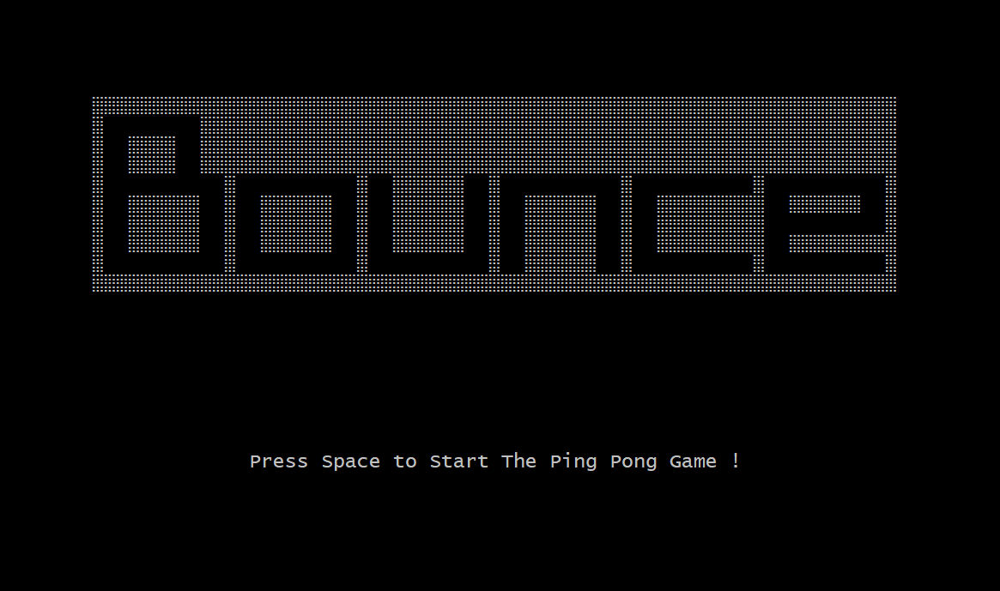
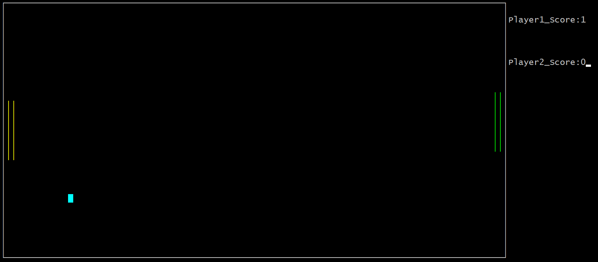
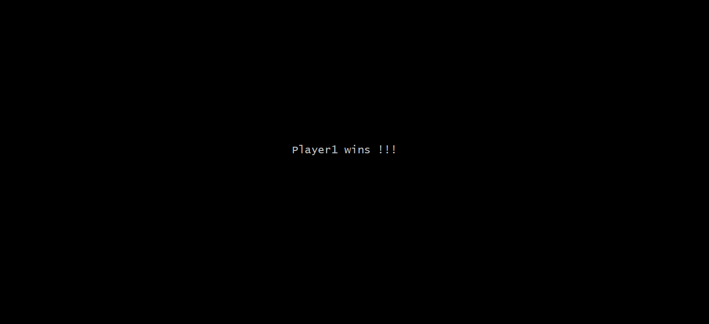

# Bounce
> - 兩人對戰的簡易乒乓球遊戲  
> - 實作語言: `組合語言`  
> - 組合語言期末小組專題
>>     遊戲規則與操作: 
>>     - 按空白鍵開始遊戲，球開始移動。
>>     - 左邊 Player1 按 W 鍵和 S 鍵控制左桿上下移動接球；右邊Player2 按 Up 鍵、Down 鍵控制右桿上下移動接球。
>>     - 若球碰到右邊邊界，則 Player1 得 1 分；反之 Player2 得 1 分，先得到 5 分即獲勝。
## - Execution
  
## - 遊戲畫面
  
## - One of the players wins.
  
